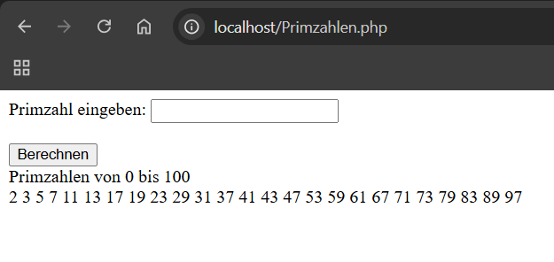
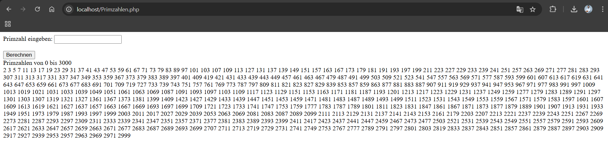
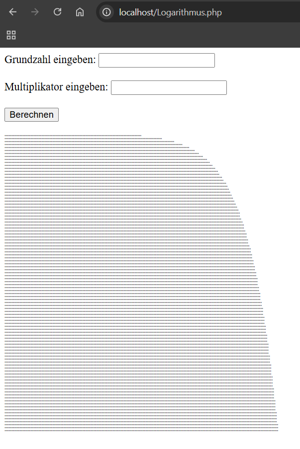

# Primzahlen
 

## Informationen zum Bericht:
- **Schuljahr:** 2024/25
- **Name:** Leo Mtetwa
- **Lehrgang:** LG2
- **Klasse:** 3a APC
- **Übungstag:** 27.11.2024
- **Gruppe:** B

### Programmiersprache:
*PHP*

## Aufgabe
Primzahlenberechnung:
-	Auf einer HTML Seite sind alle Primzahlen von 1 bis zur eingegeben Zahl auszugeben.
-	Tipp: Jede Zahl durch alle Zahlen von 2 bis n/2 dividieren

Übung:
-	Ausgabe der Logarithmischen Funktion:
-	Berechne den Log(n) für alle Zahlen von 1 bis 100
-	Gib jeweils Sterne in einer Zeile für jedes Ergebnis aus.


### Umsetzung des Projekts:
*Übung 1: Ich habe mit einer Form ein Eingabefeld gemacht, welches dann eine Zahl weiterschickt. Mit einer Schleife habe ich dann geschaut was für Primzahlen bis zur eingegebenen Zahl kommen und diese gebe ich dann aus*

*Übung 2: Ich habe wieder mit einer Form gearbeitet. Diesmal habe ich dann einfach nur nach der Logarithmischen Berechnung gesucht und auch ein Samplecode gefunden. Diesen habe ich dann übersetzt und benutzt. Im Prinzip ist es eh nur eine Forschleife mit zwei Berechnungen*

### Code Blöcke Primzahlen:
Damit habe ich die Form gemacht
```PHP
<form method="post" action="">
        <label for="Primzahl">Primzahl eingeben:</label>
        <input type="text" id="Primzahl" name="Primzahl"><br><br>
        
        <input type="submit" name="berechnen" value="Berechnen">
    </form>
```

Hier ist die Schleife mit der ich geschaut habe ob eine Zahl eine Primzahl ist oder nicht.
```PHP
<?php
    if (isset($_POST['berechnen'])) {
        $zahl = $_POST['Primzahl'];
        echo "Primzahlen von 0 bis $zahl <br>";
        for ($checker = 2; $checker <= $zahl; $checker++) {
            $isPrime = true;
            for ($i = 2; $i <= $checker/2; $i++) {
                if ($checker % $i == 0) {
                    $isPrime = false;
                    break;
                }
            }
            if ($isPrime) {
                echo $checker . " ";
            }
        }
    }
    ?>
```

### Code Blöcke Logarithmus:

Style für die Sterne
```PHP
<style>
    .log-curve {
        font-size: 3pt;
        white-space: pre;
    }
</style>
```

Form
```PHP
<form method="post" action="">
        <label for="Grundzahl">Grundzahl eingeben:</label>
        <input type="text" id="Grundzahl" name="Grundzahl"><br><br>
        
        <label for="Multiplikator">Multiplikator eingeben:</label>
        <input type="text" id="Multiplikator" name="Multiplikator"><br><br>

        <input type="submit" name="berechnen" value="Berechnen"><br><br>
    </form>
```

Code für die Logarithmusdarstellung
```PHP
<?php
    if (isset($_POST['berechnen'])) {
        $base = $_POST['Grundzahl'];
        $multiplier = $_POST['Multiplikator'];
        
        for ($i = 1; $i <= 100; $i++) {
            $logValue = log($i * $multiplier) / log($base); // Logarithmus zur Basis $base^
            $stars  = str_repeat('*', round($logValue * $multiplier));
            echo  "<div class='log-curve'>$stars</div>" ;
        }
    }
    ?>
```

### Bilder Primzahl:



### Bilder Logarithmus:


### Fazit:
*Waren zwei Coole Übungen, die mir aber auch den Umgang mit PHP näher gebracht haben.*
